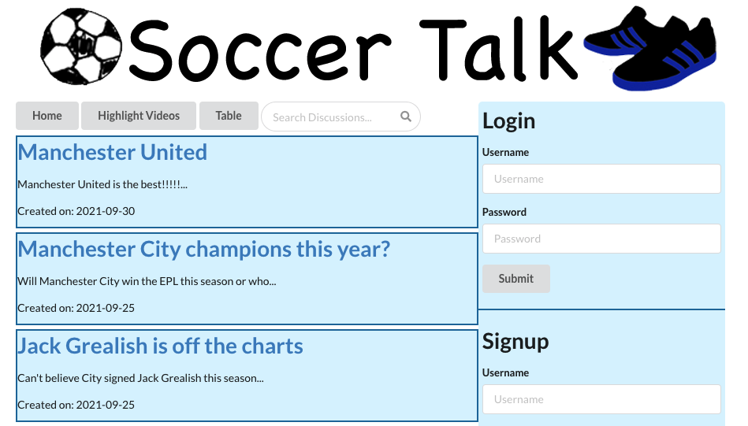

# Soccer Talk

Soccer Talk is a forum where you can read through different discussions about Soccer. You an also create your own account so that you can create your own discussions and comment on other users discussions. The database for this app is in another repository at [Soccer Talk Database](https://github.com/bsmitty815/soccer-talk-db)

# Getting Started with Create React App

This project was bootstrapped with [Create React App](https://github.com/facebook/create-react-app).

# Install Your Own Copy
Follow these instructions to install your own copy on your computer

1. Fork the repo.
2. Then click the green button on the top right
3. Copy the SSH link
4. Open up your terminal on your computer
5. Type `git clone` plus SSH copied link and press enter
6. type `cd soccer-talk` and press enter
7. type `npm start` in the terminal to get your the app server up and running

### `npm start`

Runs the app in the development mode.\
Open [http://localhost:3006](http://localhost:3006) to view it in the browser. Not you must have the database running as well to see the data on the screen.

The page will reload if you make edits.

## Learn More

You can learn more in the [Create React App documentation](https://facebook.github.io/create-react-app/docs/getting-started).

To learn React, check out the [React documentation](https://reactjs.org/).

# Resources
API - https://www.api-football.com/documentation-v3#section/Introduction
I used the api-football to get data from. I used that api to import the standings in to my table which you will need a key for if you decide to use it.

This application was built using React, HTML, CSS, JavaScript, Redux, and Simantic UI.